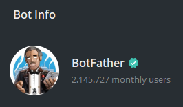
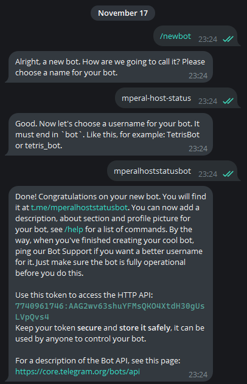
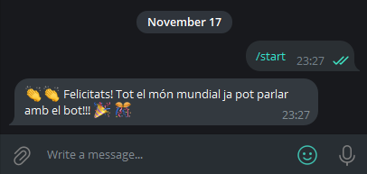
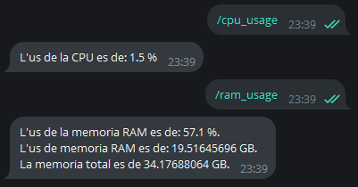

# Telegram Bot Simple

Aquest bot sera molt simple, i en el meu cas, demanara al sistema un s'executa, l'estat de la maquina:
- Ús de CPU
- Memoria RAM disponible

## Preparacio de l'entorn
Primer de tot, prepararem l'entorn.
1. En cas de fer servir **conda** crearem un entorn virtual
    ```
    conda create -n m01-a07-telegram-bot-simple python=3.12
    ```
2. Instal·larem els paquets necessaris
    - `python-telegram-bot` per interactuar amb telegram
    - `psutil` per obtenir informacio del sistema on s'executa el bot.

## Creacio del bot en telegram
Per crear el bot, hem de parlar amb un bot creat per Telegram, anomenat **botfather**.



Si interactuem amb aquest bot, podem crear un per el nostre proposit.



## Prova inicial
Copiant l'exemple de [bot1.py](https://github.com/fbarraga/CEIABD_M01/blob/main/bot1.py), si l'executem amb el token que ens ha donat telegram, podem comprovar que si iniciem una conversa amb ell, ens respondra.




## Programacio personalitzada del bot
Amb la base de **bot1.py**, podem fer algunes modificacions per que aquest bot cumpleixi amb el proposit del exercici. En aquest cas, llegir la CPU y la memoria RAM del sistema.

Fent servir la llibreria **psutil**, podem obtenir informacio del sistema. Amb aquesta modificacio de codi, donem la possibilitat de preguntar, fent servir el bot de telegram.
```python
async def cpu_usage(update: Update, context: ContextTypes.DEFAULT_TYPE) -> None:
    await update.message.reply_text(
        f"L'us de la CPU es de: {psutil.cpu_percent(1)} %"
    )

async def ram_usage(update: Update, context: ContextTypes.DEFAULT_TYPE) -> None:
    memoria = psutil.virtual_memory()
    await update.message.reply_text(
        f"L'us de la memoria RAM es de: {memoria[2]} %.\nL'us de memoria RAM es de: {memoria[3]/1000000000} GB.\nLa memoria total es de {memoria[0]/1000000000} GB."
    )
```

I la resposta del bot seria la seguent



## Investigació i desenvolupament
Com a millores o funcionalitats extra, en aquest cas, es podrien afegir funcions d'administració que es podrien executar desde la distancia. Per exemple, en cas de trobar-te lluny i voler accedir, arrencar el servei de escriptori remot, o connectar la maquina a una VPN. En cas de tenir algun problema i que la maquina no respongui físicament, tancar algun procés, etc...

Les possibilitats son il·limitades, ja que amb APIs es pot fer de tot.

# Prova del bot

Per provar el bot, s'ha de tenir un fitxer `token.txt` amb el token que proporciona telegram. 
El bot que es mostra en les imatges s'ha esborrat per raons obvies, per lo que s'ha de crear un bot i guardar el token que retorna **botfather**.

Una vegada tenim el token, i l'entorn de python preparat, executem el bot amb 
```python
python ./main.py
```

A la consola ens sortira el token del nostre bot, i aixo vol dir que ja está operatiu. Només cal anar a telegram i escriure `/cpu_usage` o `/ram_usage`.